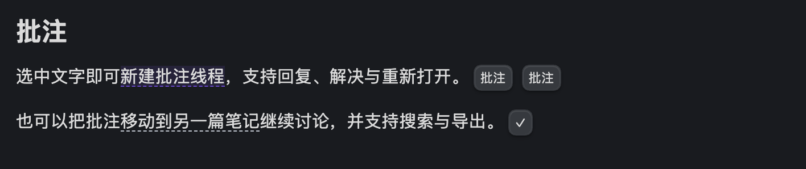
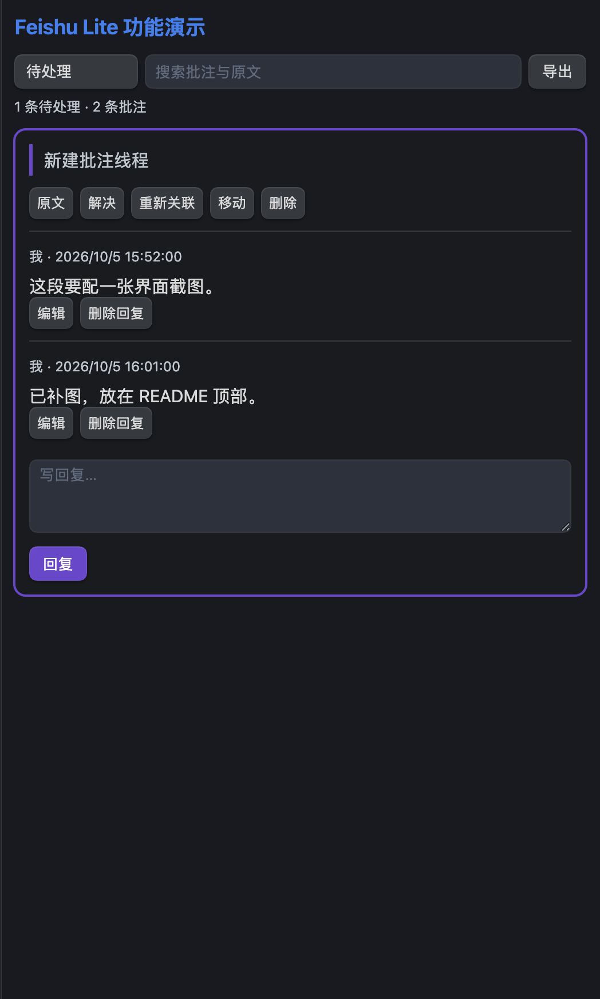
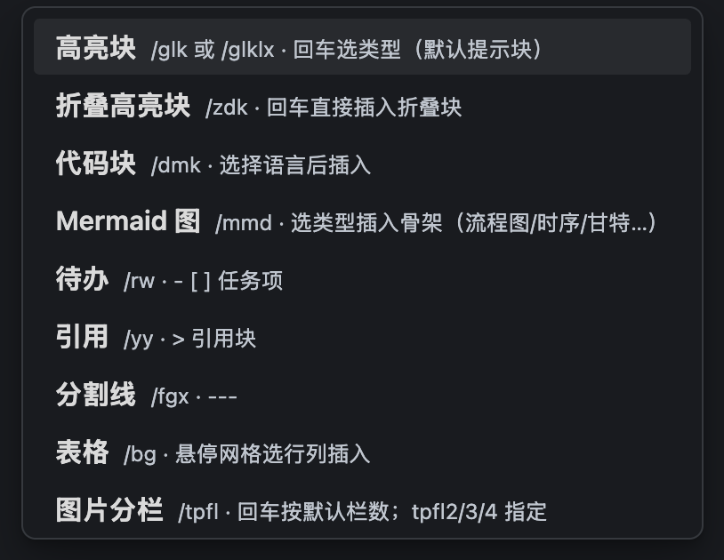
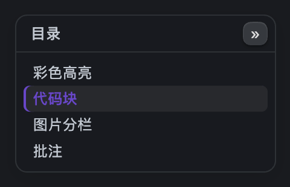
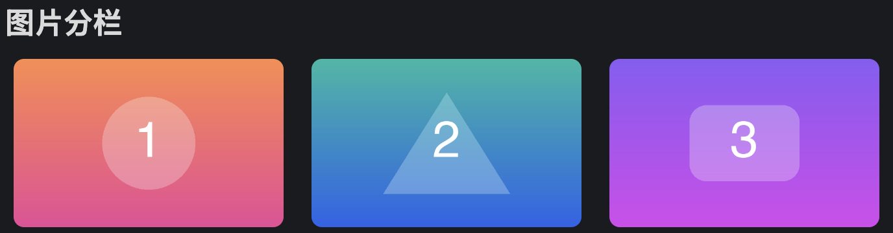
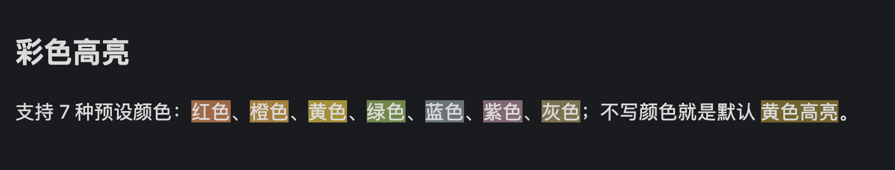
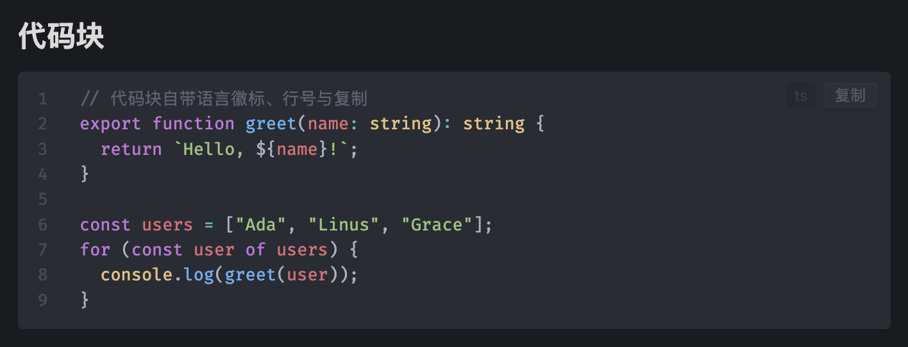

# Feishu Lite

**飞书文档风格的 Obsidian 编辑体验。** 批注、图片、斜杠命令、彩色高亮——每项能力见下方配图展示。

Lark-doc-style editing for Obsidian: annotations, image layout & crop-annotate, slash menu, image grids, paste auto-rename, colored highlights, code line numbers, and more.

## 功能展示

**笔记批注** —— 划词新建批注线程，支持回复、解决 / 重新打开；正文标记与侧栏面板，数据保存在笔记内





**斜杠菜单** —— 行首 `/` 唤起，中文 / 英文 / 拼音匹配；回车选类型、参数级联展开



**浮动目录** —— 右缘窄轨常驻（移动端为悬浮按钮），悬停 / 点按展开为大纲卡片；多级折叠、滚动跟随、点击跳转



**图片分栏** —— `img-2/3/4` 网格，多图粘贴自动成栏



**彩色高亮** —— `=={red}文字==` 七色，划词工具条一键套用



**代码块行号** —— 语言徽标、行号与复制按钮



## 功能亮点

- **笔记批注** — 划词工具条新建，正文标记展开；回复、解决 / 重新打开、重新关联、跨笔记移动、搜索与导出；桌面侧栏、手机底部弹层，数据保存在笔记内；实现说明见 [批注与图片编辑架构](docs/annotations-and-images.md)
- **图片工具条** — 拖边缘缩放、点一下居中、就地写图注；右键提供精确宽度、完整对齐、图文并排、分栏换位、查看、替换和裁剪标注
- **图片裁剪与标注** — 裁剪、完整实心箭头、方框、画笔、文字、选择移动 / 删除、撤销 / 重做；箭头按预览笔宽绘制，保存新 PNG 并保留原图和可编辑项目
- **斜杠菜单** — 行首 `/`，中文 / 英文 / 拼音匹配；参数化命令双栏级联，回车即用
- **图片分栏** — `img-2/3/4` 网格，阅读 / 编辑双端渲染；多图粘贴自动成栏
- **粘贴自动命名** — `{note}-{date}-{i}` 模板存入附件目录，可选 WebP / JPEG 压缩
- **彩色高亮** — `=={red}文字==` 七色；划词工具条（高亮 / 内联代码 / 删除线，再点取消）
- **表格 / 列表增强** — Tab 跳格自动对齐、行列增删；`Cmd+Shift+↑/↓` 移动子树；对 Advanced Tables / Outliner 自动让位
- **阅读视图美化** — 代码块徽标 / 复制 / 行号、表格斑马纹
- **图片查看器** — 右键图片点「查看图片」悬浮放大：滚轮缩放、拖拽平移、Esc / 点击空白关闭（关闭图片工具条时保持直接点击查看）
- **浮动目录** — 右侧悬浮大纲：多级标题折叠（滚动进折叠分支自动展开）；桌面悬停展开，移动端悬浮按钮点按展开；滚动跟随、点击跳转
- **还有** — Mermaid 骨架、中英混排美化、阅读位置记忆、附件自动清理、目录页自动化

## Features

- **Note annotations** — Selection-toolbar comments, replies, resolve/reopen, reassociate, move between notes and export; note-owned portable data, desktop sidebar and mobile sheet
- **Image tools** — Aspect-ratio drag resize, one-click centering and inline captions; secondary actions live in the image context menu
- **Crop & annotate** — Crop, arrows, rectangles, pen and text with undo/redo; export a new PNG and retain its original and editable project
- **Slash menu** — `/` at the start of a line, with Chinese / English / pinyin matching; two-pane cascading pickers for parameterized commands
- **Image grids** — `img-2/3/4` callout layouts rendered in reading and editing views; multi-image paste wraps automatically
- **Paste auto-rename** — `{note}-{date}-{i}` templates into your attachment folder; optional WebP / JPEG compression
- **Colored highlights** — `=={red}text==` (seven colors) plus a selection toolbar (highlight / recolor / inline code / strikethrough, click again to remove)
- **Table & list enhancements** — Tab navigation with auto-alignment, row and column editing, `Cmd+Shift+↑/↓` subtree moves; yields to Advanced Tables / Outliner
- **Reading view polish** — code block badges, copy button and line numbers, zebra tables
- **Image lightbox** — choose View Image in the context menu: wheel scaling, drag to pan, Esc / click-outside to close (reading & editing views)
- **Floating outline** — collapsible heading tree, scroll-following highlight, click to jump; hover-to-expand rail on desktop, tap-to-expand floating button on mobile
- **Also included** — Mermaid snippets, CJK–Latin spacing, reading position memory, attachment cleanup, index-page automation

## 安装 / Installation

- **社区插件市场 / Community plugins**：设置 → 社区插件 → 搜索 "Feishu Lite" / Settings → Community plugins → search "Feishu Lite"
- **社区页面 / Community page**：[community.obsidian.md/plugins/feishu-lite](https://community.obsidian.md/plugins/feishu-lite) — 一键 Add to Obsidian / one-click install
- **手动 / Manual**：从 [Releases](https://github.com/mx-pai/feishu-lite/releases) 下载 `main.js`、`manifest.json`、`styles.css`，放入 `<vault>/.obsidian/plugins/feishu-lite/` 后启用 / download from Releases into `<vault>/.obsidian/plugins/feishu-lite/`, then enable

Requires Obsidian 1.7.2+ · MIT License

## 开发 / Development

```bash
npm install
npm test        # 纯逻辑 + 并发/恢复与附件安全测试
npm run build   # 类型检查 + esbuild 生产构建 → main.js
```
